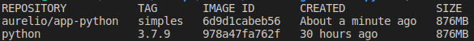
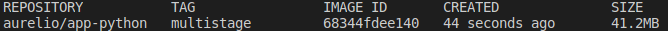

# Ambiente de estudo Multistage

> Executando Hello World utilizando Multistage

### 🚀 Execução

1ª Executa o build
```console
docker build -t mult/app-python:multistage . 
```

2ª Executa o build
```console
docker container run mult/app-python:multistage
```
Será exibido o **Ola mundo** na tela.

### Resultados

Container sendo excutado sem o Multistage:



Container sendo executado com o Multistage:


### 🛠 Tecnologias


### **:books: REFERÊNCIAS*

- [Docker - Python](https://hub.docker.com/_/python?tab=description&page=1&ordering=last_updated)
- [Docker Multistage](https://docs.docker.com/develop/develop-images/multistage-build/)
- [KubeDev](https://www.youtube.com/c/fabricioveronez)